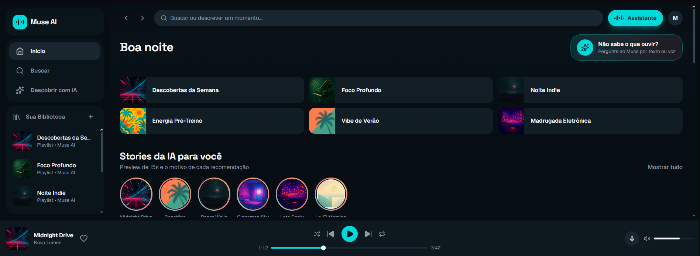

# Wavelen

AI-powered music discovery platform that helps users find the perfect song through conversational recommendations and personalized music stories.

Built as if proposing and shipping this feature inside a Spotify product team — public backlog, sprint-based development, and documented technical decisions.

## Design reference

The initial visual direction was prototyped with [v0](https://v0.app) to explore layout and UI patterns quickly: **[live design reference →](https://muse-ai-beta.vercel.app/)**

This reference defines the look and feel Wavelen is being built towards — a chat-first assistant, music "Stories", contextual recommendations with explanations, and a dynamic music profile. It is **not** the production codebase: every screen is being hand-built incrementally inside this repository, sprint by sprint, so each implementation decision (state management, security rules, API integration) is fully understood and owned.



## Tech stack

- React + TypeScript + Vite
- Tailwind CSS
- Firebase (Auth, Firestore, Functions)
- OpenAI API
- Spotify Web API

## Project management

Development follows a sprint-based backlog tracked on [GitHub Projects](https://github.com/users/gabrieldiasmenezes/projects/4) — issues, acceptance criteria, and weekly progress updates.

## Getting started

### Install dependencies
```
npm install
```

### Start development server
```
npm run dev
```

### Build for production
```
npm run build
```

## Status

🚧 Sprint 1 in progress — foundation, authentication, and Firebase setup underway.